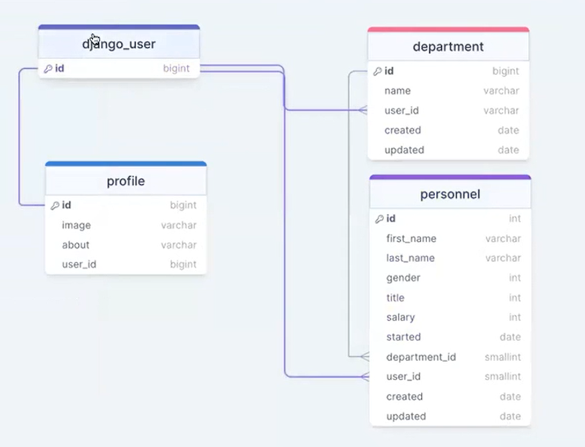
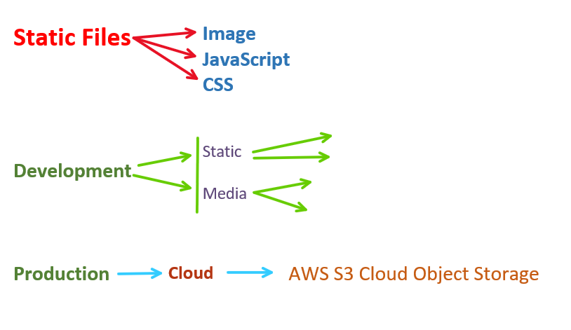

Personnel API
* Deparment ve Personnel tablolarımız olacak bunları birbirlerine bağlayacağız. .her deparmentın altında kendisine ait personel olacak.
* Staff olan personel yeni personel listeye ekleyebilecek, update edebilecek.(staff dan kasıt yetkili olan bunu farklı cheff de diyebilirsiniz.Staff ismi django user modelinde bulunan is_staff dan geliyor )
* Dinamik url ile url de gelen isteğe göre response değişecek.Yani departmenlara ait personeli listelemek istediğimizde bunu tek bir url üzerinden yapacağız.Swagger da örneği var.
* Staff olmayanlar sadece listeleyebilecek
* Personeli silme yetkisi sadece superuserlarda olacak.
* Token authentication kullanacağız. Kullanıcı logout olduğunda tokeni sileceğiz.



## Personel App

```powershell
- py -m venv env
- .\env\Scripts\activate # for windows
- pip install djangorestframework
- django-admin startproject main .
- pip install python-decouple
- py manage.py runserver
- py manage.py migrate
- pip freeze > requirements.txt
- py manage.py createsuperuser
```

- veya 
 
```powershell
- py -m venv env
- .\env\Scripts\activate
- pip install -r requirements.txt
- py manage.py migrate
- py manage.py runserver
- py manage.py createsuperuser
```


- rest_framework ' i add installed_apps 
```py
INSTALLED_APPS = [
    'django.contrib.admin',
    'django.contrib.auth',
    'django.contrib.contenttypes',
    'django.contrib.sessions',
    'django.contrib.messages',
    'django.contrib.staticfiles',
    # 3rd party packages
    'rest_framework',
]
```

- .gitignore ve .env files oluşturulacak, SECRET_KEY .env' ye eklenip, settings.py da config ile gizlenecek.


#### personnel app inin oluşturulup, personnel ve department tablolarımızın eklenmesi;

- önce department tablosunu oluşturacağız, datalarımızı admin panelden ekleyip CRUD işlemlerini yapacağız, 
- sonra personnel tablomuza geçip daha detaylı işlemlere geçeceğiz.
- Bu işlemler için yeni bir app oluşturuyoruz,

```powershell
- py manage.py startapp personnel
```

- personnel app ' i add installed_apps 

settings.py
```py
INSTALLED_APPS = [
    'django.contrib.admin',
    'django.contrib.auth',
    'django.contrib.contenttypes',
    'django.contrib.sessions',
    'django.contrib.messages',
    'django.contrib.staticfiles',
    # 3rd party packages
    'rest_framework',
    # may app
    'personnel',
]
```

- personnel app imizin içinde modellerimizi oluşturmaya başlıyoruz,

- models.py da modellerimizi oluşturuyoruz;
models.py ->
```py
from django.db import models
from django.contrib.auth.models import User

# Create your models here.
class Department(models.Model):
    name = models.CharField(max_length=32)
    user_id = models.ForeignKey(User, on_delete=models.SET_NULL, null=True)
    # created_by = models.ForeignKey(User, on_delete=models.SET_NULL, null=True)
    created = models.DateTimeField(auto_now_add=True)
    updated = models.DateTimeField(auto_now=True)
    
    def __str__(self):
        return self.name


class Personnel(models.Model):
    first_name = models.CharField(max_length=50)
    last_name = models.CharField(max_length=50)

    GENDER = (
        ("F", "Female"),
        ("M", "Male"),
        ("O", "Other"),
        ("N", "Prefer Not Say"),
    )
    gender = models.CharField(max_length=19, choices=GENDER)
        
    TITLE = (
        ("S", "Senior"),
        ("M", "Mid Senior"),
        ("J", "Junior"),
    )

    title = models.CharField(max_length=1, choices=TITLE)
    salary = models.IntegerField(default=1250)
    started = models.DateTimeField()
    department_id = models.ForeignKey(Department, on_delete=models.SET_NULL, null=True, related_name="personnel")
    user_id = models.ForeignKey(User, on_delete=models.SET_NULL, null=True, related_name="personnels")
    created = models.DateTimeField(auto_now_add=True)
    updated = models.DateTimeField(auto_now=True)

    def __str__(self):
        return f"{self.first_name} {self.last_name}"
```

```powershell
- py manage.py makemigrations
- py manage.py migrate
```

admin.py
```py
from django.contrib import admin
from .models import Department, Personnel

# Register your models here.
admin.site.register(Department)
admin.site.register(Personnel)
```

- Admin panelden department ve personnel datası ekleyelim,


serializers.py ->
```py
from rest_framework import serializers
from .models import Department, Personnel

class DepartmentSerializer(serializers.ModelSerializer):
    
    class Meta:
        model = Department
        fields = '__all__'

class PersonnelSerializer(serializers.ModelSerializer):
    
    class Meta:
        model = Personnel
        fields = '__all__'
```

- Bizden istenenler?
  - Listeleme -> Herkes
  - Create, Update -> Admin
  - Delete -> Superuser

- Hangi tip view kullanacağız ? 
  - Functionbase?
  - Classbase?
    - Generic views
        - Mixins
        - Concrete View
          - ListCreateAPIView *
          - CreateAPIView *
          - RetrieveUpdateAPIView *
          - RetrieveDestroyAPIView *
    - Viewsets


views.py ->
```py
from .serializers import DepartmentSerializer, PersonnelSerializer
from .models import Department, Personnel
from rest_framework.generics import ListCreateAPIView, RetrieveUpdateDestroyAPIView

# Department Listelemek için (Herkes);
class DepartmentListCreateView(ListCreateAPIView):
    queryset = Department.objects.all()
    serializer_class = DepartmentSerializer

# Department Retriew, Update, Delete için (admin);
class DepartmentRUDView(RetrieveUpdateDestroyAPIView):
    queryset = Department.objects.all()
    serializer_class = DepartmentSerializer
    
# Personnel Listelemek için (Herkes);
class PersonnelListCreateView(ListCreateAPIView):
    queryset = Personnel.objects.all()
    serializer_class = PersonnelSerializer

# Personnel Retriew, Update, Delete için (admin);
class PersonnelRUDView(RetrieveUpdateDestroyAPIView):
    queryset = Personnel.objects.all()
    serializer_class = PersonnelSerializer
```


- urls configuration ->
main.urls
```py
from django.contrib import admin
from django.urls import path, include

urlpatterns = [
    path('admin/', admin.site.urls),
    path('', include('personnel.urls')),
]
```

personnels.urls
```py
from django.urls import path
from .views import (
    DepartmentListCreateView,
    DepartmentRUDView,
    PersonnelListCreateView,
    PersonnelRUDView,
)

urlpatterns = [
    path('departments/', DepartmentListCreateView.as_view()),
    path('departments/<int:pk>/', DepartmentRUDView.as_view()),
    path('personnels/', PersonnelListCreateView.as_view()),
    path('personnels/<int:pk>/', PersonnelRUDView.as_view()),
]
```

- Test ediyoruz, çalıştı. 
- Genel çatı hazır.

- Nested Serializers lardan devam edelim. ->
- Department serializer ımızda, Department modelimizin child modeli olan Personnel modelindeki personelleri de göstereceğiz. 
- Yeni bir serializer yazıyoruz, DepartmentPersonnelSerializer->
- serializers.py ->
```py
class DepartmentPersonnelSerializer(serializers.ModelSerializer):
    
    personnel = PersonnelSerializer(many=True, read_only=True)
    
    class Meta:
        model = Department
        fields = ("id", "name", "personnel")

```

- Yazdığımız serializer ı kullanacak View imizi yazıyoruz;
- Bu view imizde herhangi bir create/update/delete yapmayacağız, sadece listeleyeceğiz. Bunun için Concrete viewlerden ListAPIView i kullanacağız.
views.py ->
```py
from rest_framework.generics import ListAPIView
from .serializers import DepartmentPersonnelSerializer

class DepartmentPersonnelView(ListAPIView):
    queryset = Department.objects.all()
    serializer_class = DepartmentPersonnelSerializer
```

- viewimizi çalıştıracak endpointi yazalım;
- urls.py ->
```py
from django.urls import path
from .views import (
    DepartmentListCreateView,
    DepartmentRUDView,
    PersonnelListCreateView,
    PersonnelRUDView,
    DepartmentPersonnelView
)

urlpatterns = [
    path('departments/', DepartmentListCreateView.as_view()),
    path('departments/<int:pk>/', DepartmentRUDView.as_view()),
    path('personnels/', PersonnelListCreateView.as_view()),
    path('personnels/<int:pk>/', PersonnelRUDView.as_view()),
    path('department-personnels/', DepartmentPersonnelView.as_view()),
]
```

- Test ettik, çalıştı.

- Dinamik urls ->

personnels.urls
```py
    # path('department-personnels/', DepartmentPersonnelView.as_view()),
    path('departments/<str:department>/', DepartmentPersonnelView.as_view()),
```

- Bunun için view imizde kullandığımız queryset'i, arka planda çalışan get_queryset() methodunu override ederek değiştireceğiz.
- List view kullanıyorsak, query parameter ile filtreleme -> request içinde bir query_params varsa onu yakalayıp, queryset içinde filtreleyip, queryset olarak return edeceğiz.

views.py ->
```py
class DepartmentPersonnelView(ListAPIView):
    queryset = Department.objects.all()
    serializer_class = DepartmentPersonnelSerializer
    
    def get_queryset(self):
        """
        Optionally restricts the returned department to a given one,
        by filtering against a `department` query parameter in the URL.
        """
        department = self.kwargs['department']
        if department is not None:
            return Department.objects.filter(name__iexact=department)
```


#### permissions lar 

- user Admin ise şunları yapsın, Normal ise şunları yapsın;
- Bunun için custom Permissions lar yazacağız,
- create permissions.py
- view seviyesinde bir permission yazacağız, has_permission() methodunu override edeceğiz.
- SAFE_METHODS lar da herkese izin ver, diğer methodlarda sadece admin usera izin ver.

permissions.py
```py
from rest_framework.permissions import (
    IsAdminUser,
    SAFE_METHODS,
)

class IsAdminOrReadOnly(IsAdminUser):
    
    def has_permission(self, request, view):
        if request.method in SAFE_METHODS:
            return True
        return bool(request.user and request.user.is_staff)
```

- Yazdığımız custom permission ı viewlerimizde kullanabiliriz.
- custom permission ımızı ve IsAuthenticated permissions larımızı import ediyoruz.
- DepartmentListCreateView, PersonnelListCreateView, DepartmentPersonnelView viewlerimizde kullanıyoruz.

views.py ->
```py
from .serializers import (
    DepartmentSerializer, 
    PersonnelSerializer,
    DepartmentPersonnelSerializer
)
from .models import Department, Personnel
from rest_framework.generics import (
    ListCreateAPIView, 
    RetrieveUpdateDestroyAPIView,
    ListAPIView,
)
from .permissions import IsAdminOrReadOnly
from rest_framework.permissions import IsAuthenticated

# Department Listelemek için (Herkes);
class DepartmentListCreateView(ListCreateAPIView):
    queryset = Department.objects.all()
    serializer_class = DepartmentSerializer
    permission_classes = (
        IsAuthenticated,
        IsAdminOrReadOnly,
    )

# Department Retriew, Update, Delete için (admin);
class DepartmentRUDView(RetrieveUpdateDestroyAPIView):
    queryset = Department.objects.all()
    serializer_class = DepartmentSerializer
    
    
# Personnel Listelemek için (Herkes);
class PersonnelListCreateView(ListCreateAPIView):
    queryset = Personnel.objects.all()
    serializer_class = PersonnelSerializer
    permission_classes = (
        IsAuthenticated,
        IsAdminOrReadOnly,
    )


# Personnel Retriew, Update, Delete için (admin);
class PersonnelRUDView(RetrieveUpdateDestroyAPIView):
    queryset = Personnel.objects.all()
    serializer_class = PersonnelSerializer

    
class DepartmentPersonnelView(ListAPIView):
    queryset = Department.objects.all()
    serializer_class = DepartmentPersonnelSerializer
    permission_classes = (
        IsAuthenticated,
        IsAdminOrReadOnly,
    )

    
    def get_queryset(self):
        """
        Optionally restricts the returned purchases to a given user,
        by filtering against a `username` query parameter in the URL.
        """
        department = self.kwargs['department']
        if department is not None:
            return Department.objects.filter(name__iexact=department)
```


- Kalan iki view imizde DepartmentRUD ve PersonnelRUD view lerimizde başka permissionslar kullanacağız. 
- superuserlar delete yapabilecek, adminler update yapabilecek. Bu ikisini ayırmak için başka işlem yapacağız.
- Bunu nasıl yapabiliriz?
  1. Yöntem: RetrieveDestroy ile RetrieveUpdate i birbirinden ayırıp, RetrieveUpdate' e permission class olarak IsAdmin yeterli olur. RetrieveDestroy 'da ise superuser kontrol edilir. İkinci bir custom permission yazılır.

  2. Yöntem: RetrieveUpdateDestroyAPIView' inin source kodunda put  ve delete için tanımlanmış methodlar var. Bunları viewimizde override ederek put için staff ve superuser kontrolü yapıp, delete için superuser kontrolü yapıp, bu şartları getirebiliriz.

2. Yöntemden devam ->

- Öncelikle IsAuthenticated permission class ı kullanarak eğer user authenticate değil ise sonraki logic işlemlerine başlamasın.
- PersonnelRUDView imizde put() methodumuzu override ediyoruz.
- delete işlemi için ise daha derine inip, RetrieveUpdateDestroyAPIView in source kodundaki DestroyModelMixin source kodundaki destroy() methodunu override ediyoruz. Bizim işimize bu daha çok uyuyor.

views.py
```py
from rest_framework.response import Response
from rest_framework import status

# Personnel Retriew, Update, Delete için (admin);
class PersonnelRUDView(RetrieveUpdateDestroyAPIView):
    queryset = Personnel.objects.all()
    serializer_class = PersonnelSerializer
    permission_classes = (IsAuthenticated)
    
    def put(self, request, *args, **kwargs):
        if self.request.is_superuser or self.request.user.is_staff:
            return self.update(request, *args, **kwargs)
        data = {
            'message': 'You are not authorized to update!'
        }
        return Response(data, status=status.HTTP_401_UNAUTHORIZED)
    
    def destroy(self, request, *args, **kwargs):
        instance = self.get_object()
        if self.request.is_superuser:
            # self.perform_destroy(instance)
            instance.delete()
            return Response(status=status.HTTP_204_NO_CONTENT)
        data = {
            'message': 'You are not authorized to update!'
        }
        return Response(data, status=status.HTTP_401_UNAUTHORIZED)
```

- Bu PersonnelRUDView viewinde yaptığımız override işleminin aynısını DepartmentRUDView viewinde de yapıyoruz,
views.py
```py
# Department Retriew, Update, Delete için (admin);
class DepartmentRUDView(RetrieveUpdateDestroyAPIView):
    queryset = Department.objects.all()
    serializer_class = DepartmentSerializer
    permission_classes = (IsAuthenticated)
    
    def put(self, request, *args, **kwargs):
        if self.request.is_superuser or self.request.user.is_staff:
            return self.update(request, *args, **kwargs)
        data = {
            'message': 'You are not authorized to update!'
        }
        return Response(data, status=status.HTTP_401_UNAUTHORIZED)
    
    def destroy(self, request, *args, **kwargs):
        instance = self.get_object()
        if self.request.is_superuser:
            # self.perform_destroy(instance)
            instance.delete()
            return Response(status=status.HTTP_204_NO_CONTENT)
        data = {
            'message': 'You are not authorized to update!'
        }
        return Response(data, status=status.HTTP_401_UNAUTHORIZED)
```

- Hem Department için hem de Personnel için delete etme yetkisi superuser da olacak, update yetkisi adminlerde olacak.


#### registration, login, logout

- registration, login, logout işlemleri için yeni bir app oluşturacağız.

- users app i oluştur,

```powershell
- py manage.py startapp users
```

- INSTALLED_APPS ' e ekle,
settings.py
```py
INSTALLED_APPS = [
    ...
    # may apps
    'personnel',
    'users',
]
```

- settings.py 'a TokenAuthentication ekle
settings.py
```py
REST_FRAMEWORK = {
    'DEFAULT_AUTHENTICATION_CLASSES': [
        'rest_framework.authentication.TokenAuthentication',
    ]
}
```

- dj-rest-auth  paketini yükle
```powershell
- pip install dj-rest-auth
- pip freeze > requirements.txt
```

- INSTALLED_APPS 'e 'rest_framework.authtoken' ve 'dj_rest_auth' paketini ekle.
settings.py
```py
INSTALLED_APPS = [
    ...
    # 3rd party packages
    'rest_framework',
    'rest_framework.authtoken',
    'dj_rest_auth',
    # may apps
    'personnel',
    'users',
]
```

- migrate
```powershell
- py manage.py migrate
```

- urls configürasyonu yap,

main/urls.py
```py
from django.contrib import admin
from django.urls import path, include

urlpatterns = [
    path('admin/', admin.site.urls),
    path('api/', include('personnel.urls')),
    path('users/', include('users.urls')),
] 
```
- create users/urls.py ve dj_rest_auth paketinin path ini ekliyoruz.->
users/urls.py
- url pathern ' dj_rest_auth endpointini ekle
```py
from django.urls import path, include

urlpatterns = [
    path('auth/', include('dj_rest_auth.urls')),
]
```

- users app ini oluşturduktan sonra, global olarak TokenAuthentication ayarladık, users ve auth_token ı installed apps e ekledik, urls configürasyonunu yaptık ve django rest auth un bize verdiği endpointleri kurduk/gördük.

- erd yi inceleyip users app inin içinde model.py 'a gidip, Profile modelimizi oluşturuyoruz,


users/models.py
```py
from django.db import models
from django.contrib.auth.models import User

class Profile(models.Model):
    image = models.ImageField(upload_to='images',default='avatar.png', height_field=None, width_field=None, max_length=None)
    about = models.TextField(blank=True, null=True)
    user = models.OneToOneField(User, on_delete=models.CASCADE)
    
    def __str__(self):
        # return self.user.username
        # return self.user.first_name
        return f'{self.user.username} - {self.user.first_name}'
```

- install Pillow
```powershell
- pip install Pillow
- pip freeze > requirements.txt
- py manage.py makemigrations
- py manage.py migrate
```

- admin.py ->
```py
from django.contrib import admin
from .models import Profile

# Register your models here.
admin.site.register(Profile)
```

#### static/media settings 

- static files -> development ortamında static file ları görebilmek için settings.py ve urls.py da yapmamız gereken ayarlar.

https://docs.djangoproject.com/en/4.2/howto/static-files/



main/urls.py ->
```py
from django.conf import settings
from django.conf.urls.static import static

 + static(settings.MEDIA_URL, document_root=settings.MEDIA_ROOT)
```

- settings.py ->
```py
MEDIA_URL = '/media/'
MEDIA_ROOT = BASE_DIR / "media"
```


#### registration 

- Şu an için dj_rest_auth un sunduğu login, logout, password_change, password_reset imiz var. Registration ı kendimiz yazacağız. Burada ya register serializer yada Profile serializer yazacağız. Biz RegisterSerializer yazmaya karar veriyoruz.

- users/serializers.py create edip, register serializerımızı yazıyoruz. Bu standart bir register serializer ı dır. Tüm projelerde kullanılabilir.
  
users/serializers.py ->
```py
from rest_framework import serializers
from django.contrib.auth.models import User
from rest_framework.validators import UniqueValidator
from django.contrib.auth.password_validation import validate_password


class RegisterSerializer(serializers.ModelSerializer):
    
    email = serializers.EmailField(
        required = True,
        validators = [
            UniqueValidator(queryset=User.objects.all())
        ],
    )

    password = serializers.CharField(
        write_only = True,  # GET methods can not return the password
        required = True,
        validators = [
            validate_password
        ],
        style = {
            'input_type':'password',
        }
    )

    password2 = serializers.CharField(
        write_only = True,
        required = True,
        style = {
            'input_type':'password',
        }
    )

    class Meta:
        model = User
        fields = (
            'username',
            'email',
            'password',
            'password2',
        )

    def create(self, validated_data):
        password = validated_data.pop('password')
        validated_data.pop('password2')
        user = User.objects.create(**validated_data)
        user.set_password(password)
        user.save()
        return user

    def validate(self, data):
        if data.get('password') != data.get('password2'):
            data = {
                "password": "Password fields does not match!!!"
            }
            raise serializers.ValidationError(data)
        return data
```

- login, logout, password_change, password_reset bize hazır geliyor dj_rest_auth ile ancak registration için serializer, view, url tanımlamamız gerekiyor.
- registration view imizle sadece create işlemi yapacağımız için Concrete viewlerden CreateAPIView den inherit ederek yazacağız.

- users/views.py ->
```py
from rest_framework.generics import CreateAPIView
from django.contrib.auth.models import User
from .serializers import RegisterSerializer

class RegisterView(CreateAPIView):
    queryset = User.objects.all()
    serializer_class = RegisterSerializer
```

- view imizi yazdık, şimdi onu çalıştıracak endpoint imizi url imizi yazıyoruz,

- users/urls.py ->
```py
from django.urls import path, include
from .views import RegisterSerializer

urlpatterns = [
    path('auth/', include('dj_rest_auth.urls')),
    path('register/', RegisterSerializer.as_view()),
]
```

- Test ediyoruz, http://127.0.0.1:8000/users/register/  url'ine gidip, register olmaya çalışıyoruz, çalıştı ve bize girmiş olduğumuz username ve email datasını döndü.

- kullanıcı register olur olmaz login etmek için token create etmek için signals.py kullanıyoruz.
- users app inin içinde signals.py create edip oluşturuyoruz;

users/signals.py 
```py
from django.contrib.auth.models import User
from django.db.models.signals import post_save
from django.dispatch import receiver
from rest_framework.authtoken.models import Token


@receiver(post_save, sender=User)
def create_token(sender, instance=None, created=False, **kwargs):
    if created:
        Token.objects.create(user=instance)
```

- signals.py'ı oluşturduk, ancak bundan djangonun haberi yok, signals.py ı henüz tanımıyor. signals.py ın çalışması için apps.py da, signals.py ın da altında olduğu users app imizin içinde, ready() methodunda users.signals dosyamızın da projemiz çalışırken import edilmesini belirtiyoruz.

users/apps.py 
```py
from django.apps import AppConfig

class UsersConfig(AppConfig):
    default_auto_field = 'django.db.models.BigAutoField'
    name = 'users'
    
    def ready(self):
        import users.signals
```

- Artık kullanıcı register olur olmaz signals ile o kullanıcı için bir de token oluşuyor.
- register işlemi sonrasında kullanıcı için oluşturulan token ı alıp kullanıcıya göndermemiz gerekiyor ki kullanıcı register olur olmaz geri dönen data içerisinde onun için oluşturulmuş token ı da alsın ve login olmuş olsun ve bir sonraki isteğini token ı ile göndersin. 
- Bu işlemi, yani kullanıcı register olur olmaz signal tarafından üretilen token ı, yine kullanıcıya register verisi olarak döndüğümüz datanın içerisine koymak için RegisterView imizin create() methodunu override ediyoruz;

users/views.py
```py
from rest_framework.generics import CreateAPIView
from django.contrib.auth.models import User
from .serializers import RegisterSerializer
from rest_framework.response import Response
from rest_framework import status
from rest_framework.authtoken.models import Token

class RegisterView(CreateAPIView):
    queryset = User.objects.all()
    serializer_class = RegisterSerializer
    
    def create(self, request, *args, **kwargs):
        serializer = self.get_serializer(data=request.data)
        serializer.is_valid(raise_exception=True)
        
        user = serializer.save()
        data = serializer.data
        if Token.objects.filter(user=user).exists():
            token = Token.objects.get(user=user)
            data['token'] = token.key
        else:
            data['token'] = 'No token created for this user!!!'

        headers = self.get_success_headers(serializer.data)
        return Response(data, status=status.HTTP_201_CREATED, headers=headers)
```

- Yazdığımız conditionda eğer Token tablosunda bu kullanıcıya ait token varsa dönen dataya ekle, yoksa token üretilmemiş hatası dön (Belki bazı kullanıcılar için token üretilmeyecek).

- Test ediyoruz çalıştı. Artık kullanıcı register olunca, signal ile oluşturulan token datası da dönüş yaptığımız register datası içerisinde mevcut.

- dj_rest_auth paketinin sumuş olduğu TokenSerializer ın source koduna gidip baktığımızda, başarılı bir login işleminden sonra bize sadece token key datasını gönderdiğini görüyoruz. Ancak biz bu dönen data içerisine farklı veriler de eklemek istersek (username, email, id) eğer TokenSerializer dan inherit ederek kendi CustomTokenSerializer ımızı yazarak, dönüş datasının içerisine token key ile birlikte login olan user ın başka verilerini de koyabiliriz.
- Tabi önce login olan user ın başka datalarını da koyacağımız için, önce bir UserSerializer yazacağız ki CustomTokenSerializer da hangi dataları token ile ekleyeceksek onları oluşturalım ve CustomTokenSerializer da belirtelim.

users/serializers.py ->
```py
from dj_rest_auth.serializers import TokenSerializer

class UserSerializer(serializers.ModelSerializer):
    class Meta:
        model = User
        fields = (
            'id', 
            'username', 
            'email'
        )

class CustomTokenSerializer(TokenSerializer):
    user = UserSerializer(read_only=True)
    class Meta(TokenSerializer.meta):
        fields = (
            'key',
            'user',
        )  
```

- Biz CustomTokenSerializer yazdık ancak, hala dj_rest_auth paketinin default olarak sunduğu TokenSerializer ı çalışmakta. settings.py da default olanı değil de bizim yazdığımızı kullan demek için aşağıdaki kodu settings.py' a ekliyoruz. Artık 

settings.py ->
```py
# DJ-REST-AUTH SETTINGS:
REST_AUTH = {
    # 'TOKEN_SERIALIZER': 'path.to.custom.TokenSerializer', # example
    'TOKEN_SERIALIZER': 'users.serializers.CustomTokenSerializer',
}
```

- Artık bizim TokenSerializer, bizim yazdığımız CustomTokenSerializer olacak.

- Test ediyoruz çalıştı, login işleminden sonra token key ile birlikte user bilgileri de (id, username, email) de dönüyor.


- Profile modelimiz için, profile ın sahibi olan userın sadece update yapabilmesini stiyoruz. Önce bir serializer hazırlayacağız, 

- profile update için;
users/serializers.py ->
```py
from .models import Profile

class ProfileSerializer(serializers.ModelSerializer):
    
    user = serializers.StringRelatedField()

    class Meta:
        model = Profile
        fields = (
            'id',
            'image',
            'about',
            'user',
        )

```

- ProfileSerializer ı kullanacak view imizi yazalım, bu viewimiz sadece profile ın sahibi user tarafından update edebilmesini sağlayacak. Bunun için Concrete View lerden RetrieveUpdateView den inherit ederek  ProfileRetrieveUpdateView imizi oluşturuyoruz. 
- RetrieveUpdateView in UpdateView den farkı -> RetrieveUpdateView: Önce detayları getirir, update eder.

users/views.py ->

```py
from rest_framework.generics import RetrieveUpdateAPIView
from .models import Profile
from .serializers import ProfileSerializer

class ProfileRetrieveUpdateView(RetrieveUpdateAPIView):
    queryset = Profile.objects.all()
    serializer_class = ProfileSerializer
```

- ProfileRetrieveUpdateView imizi çalıştıracak endpointimiz/urls yazıyoruz,

urls.py ->
```py
from django.urls import path, include
from .views import (
    RegisterView,
    ProfileRetrieveUpdateView,
)

urlpatterns = [
    path('auth/', include('dj_rest_auth.urls')),
    path('register/', RegisterView.as_view()),
    path('profile/<int:pk>/', ProfileRetrieveUpdateView.as_view()),
]
```


????????????????????????????????
Bu kısım gereksiz.
NOT: Zaten kullanıcı logout olduğunda Token tablosundaki token'ı siliniyor, dj_rest_auth paketi bunu sağlıyor. Neden bir daha logout() view i yazdık anlamadım.

- logout olunduğunda token silinsin ;
views.py ->
```py
from rest_framework.decorators import api_view

@api_view(['POST'])
def logout(request):
    request.user.auth_token.delete()
    data = {
        'message': 'Logged out successfully'
    }
    return Response(data, status=status.HTTP_200_OK)
```

- yazdığımız view i çalıştıracak endpoint'i/urls de path ini yazacağız. Ancak zaten dj_rest_auth ' un bir logout/ viewi var ve django url de yukarıdan aşağı kodları okurken auth/ yukarıda olduğu için default auth/logout/ endpointinin view ini çalıştıracak, bizim yazdığımız logout view i çalışmayacak. Bunun önüne geçmek için kendi yazdığımız logout endpointini auth'un üzernde konumlandırarak logout için default olan değil de bizim yazdığımız viewi çalıştıracak endpoint çalışsın diyoruz.

urls.py ->
```py
from django.urls import path, include
from .views import (
    RegisterView,
    ProfileRetrieveUpdateView,
    logout
)

urlpatterns = [
    path('auth/logout/', logout),
    path('auth/', include('dj_rest_auth.urls')),
    path('register/', RegisterView.as_view()),
    path('profile/<int:pk>/', ProfileRetrieveUpdateView.as_view()),
]
```
- Test ediyoruz, logout için kullandığımız endpoint kendi yazdığımız logout() view ini çalıştırıyor, dj_rest_auth paketinin default logout view ini kullanmıyoruz.
????????????????????????????????


- Profile tablosunun otomatik olarak oluşturulması;
- Her user register/create edildiğinde, otomatik olarak bu user için bir de profile oluşsun istiyoruz;
- Bunun için yine token create edeken kullandığımız signals kullanacağız.

signals.py ->
```py
from .models import Profile

@receiver(post_save, sender=User)
def create_profile(sender, instance=None, created=False, **kwargs):
    if created:
        Profile.objects.create(user=instance)
```

- Test ediyoruz, postmanden yeni bir user register ediyoruz, 
- http://127.0.0.1:8000/users/register/    endpointine POST methodu ile aşağıdaki datalarla istek attığımızda; 
```json
{
    "username": "user5",
    "email": "user5@gmail.com",
    "password": "use123456",
    "password2": "use123456"
}
```
- Bize aşağıdaki veriyi dönüyor ve profile tablosunda bu user'a ait bir profile create ediliyor.
```json
{
    "username": "user5",
    "email": "user5@gmail.com",
    "token": "80ffb9abbd998f3bd4b30c7640c5700b8af84fb3"
}
```


- her departman altindaki personelin sayisini veren ek kod
personnel/serializers.py ->
```py
class DepartmentSerializer(serializers.ModelSerializer):
    
    personnel_count = serializers.SerializerMethodField()
    
    # class Meta:
    #     model = Department
    #     fields = '__all__'
    
    class Meta:
        model = Department
        fields = (
            'name',
            'personnel_count'
        )
    
    def get_personnel_count(self, obj):
        return Personnel.objects.filter(department_id=obj.id).count()
```


- Profile sayfasına sadece sahibi user veya adminler tarafindan CRUD yapabilme permission ı ekleme ->
users/permissions.py ->
```py
from rest_framework.permissions import BasePermission

class IsOwnerOrStaff(BasePermission):

    def has_object_permission(self, request, view, obj):
        """
        Return `True` if permission is granted, `False` otherwise.
        """
        return bool(request.user.is_staff or request.user == obj.user)
```


users/views.py ->
```py
from .permissions import IsOwnerOrStaff
from rest_framework.permissions import IsAuthenticated

class ProfileRetrieveUpdateView(RetrieveUpdateAPIView):
    queryset = Profile.objects.all()
    serializer_class = ProfileSerializer
    permission_classes = (IsOwnerOrStaff, IsAuthenticated)
```


#### django-cors-headers ->

https://pypi.org/project/django-cors-headers/

- Python ile yazılmış backendin, react ile yazılmış frontend ile konuşmasını sağlayacak paket ve ayarları ->

```powershel
- pip install django-cors-headers
- pip freeze > requirements.txt
```

- settings.py da INSTALLED_APPS e ekle, MIDDLEWARE' de en üst kısma ekle, CORS_ALLOWED_ORIGINS (Kabaca izin verilen server ların bir listesi)
  - Burada 3 seçenek var;
    - CORS_ALLOWED_ORIGINS -> İzin verilen serverların listesi,
    - CORS_ALLOWED_ORIGIN_REGEXES -> Belli regex ler ile izin verme,
    - CORS_ALLOW_ALL_ORIGINS -> Tüm serverlara izin ver, (Eğitim amaçlı kullanılır, Normalde izin verilen serverların listesi yazılacak yukarıdakine. Örnekleri dokümanda var.)
  - CORS_ALLOW_METHODS -> Frontendin göndereceği requestleri sınırlayabiliriz. Belli methodları kısıtlama, mesela buraya sadece GET yazarsak eğer karşı taraftaki server sadece GET request gönderebilir.

settings.py ->
```py
INSTALLED_APPS = [
    ...,
    'corsheaders',
    ...,
]


MIDDLEWARE = [
    "corsheaders.middleware.CorsMiddleware",
    ...,
    ...,
]


# CORS_ALLOWED_ORIGINS = ['*']
CORS_ALLOW_ALL_ORIGINS = True

# CORS_ALLOW_METHODS = (
#     "DELETE",
#     "GET",
#     "OPTIONS",
#     "PATCH",
#     "POST",
#     "PUT",
# )
```
